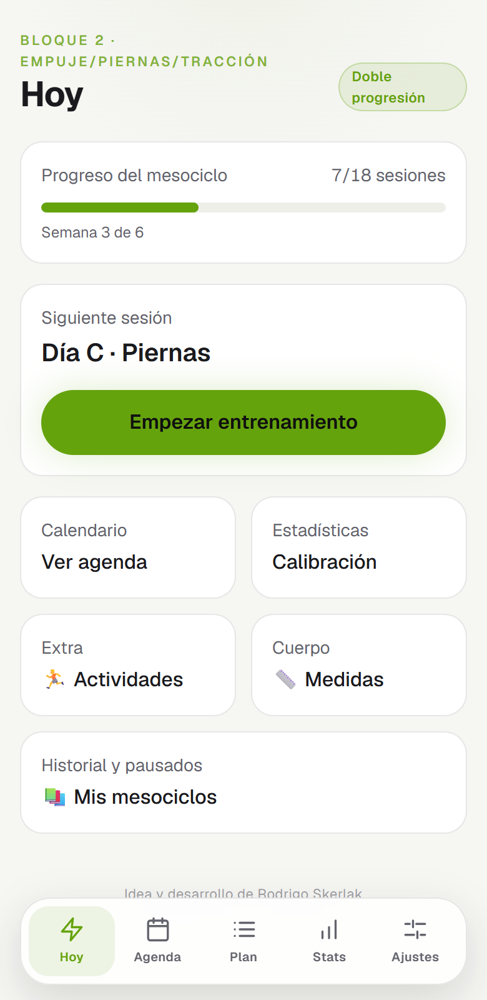
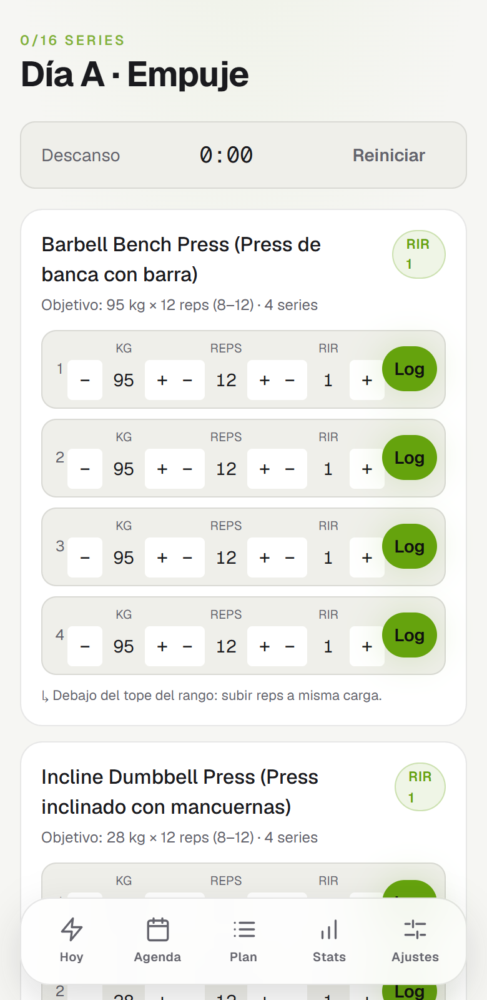
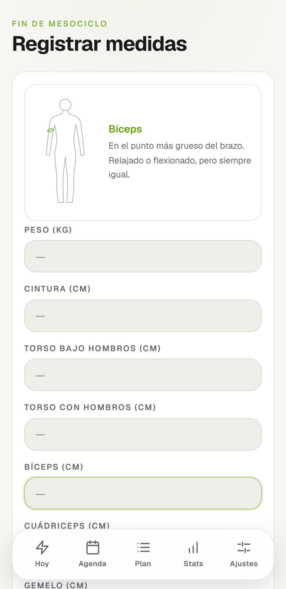
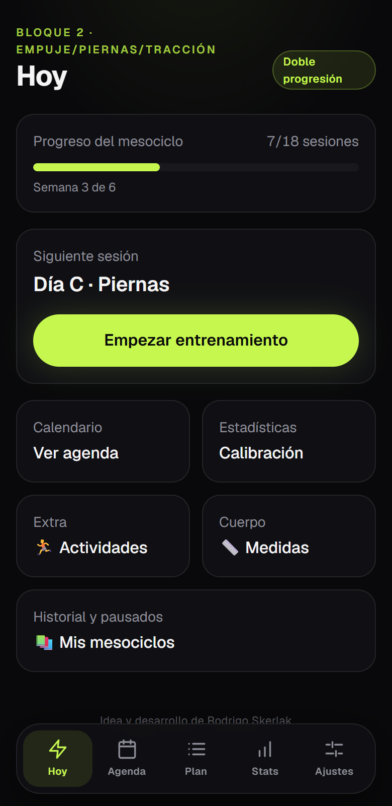
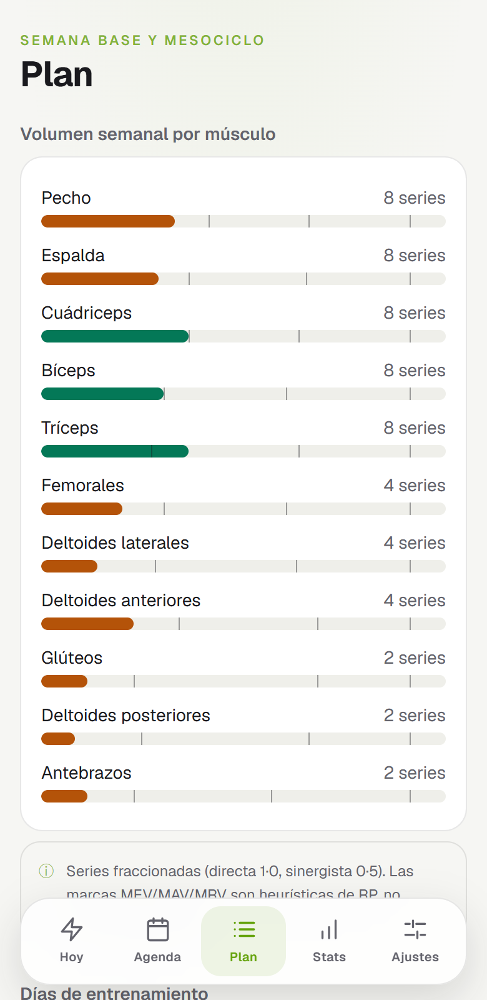
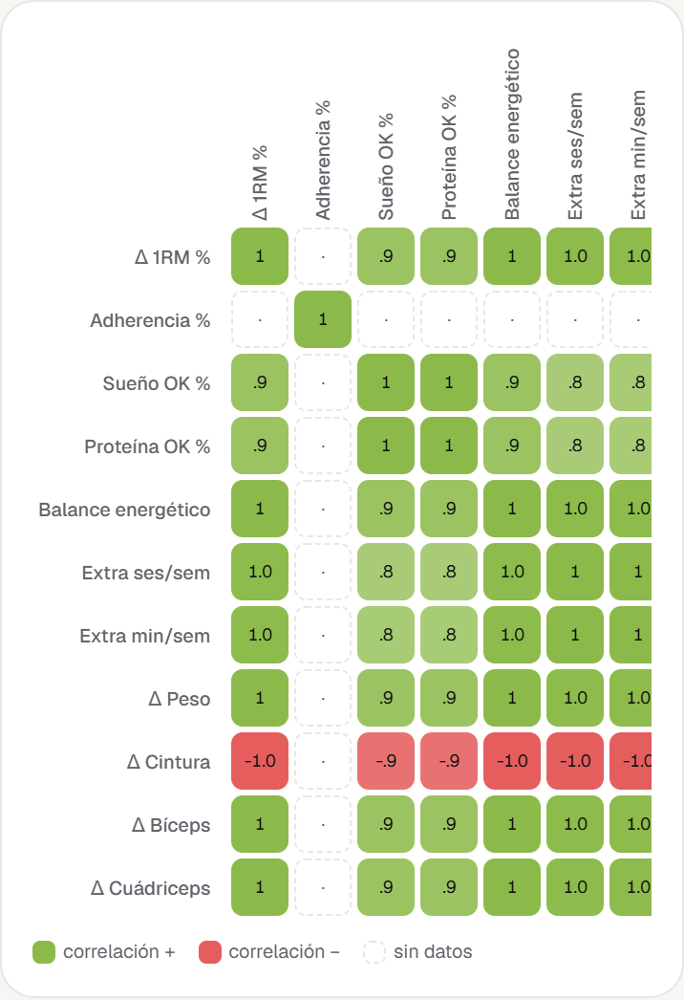

<div align="center">

# MyoNoesis

**Evidence-based hypertrophy mesocycles. A deterministic, transparent training engine.**
*Mesociclos de hipertrofia basados en evidencia. Un motor de entrenamiento determinista y transparente.*

[**▶ Live app · myo.noesisargentina.com**](https://myo.noesisargentina.com)

[](https://github.com/rskerlak/hypertrophy-app/actions/workflows/deploy-pages.yml)


[English](#english) · [Español](#español)

<br>

   

</div>

---

## English

**MyoNoesis** is an offline-first PWA that plans and runs hypertrophy training mesocycles. You define one base week (days, exercises, sets, rep ranges, starting loads); the engine generates the full cycle — volume ramp, weekly RIR targets, final deload — and then **autoregulates every next prescription from your actual logged performance**.

It is intentionally the opposite of black-box training apps: every number is explained, every scientific threshold lives in a versioned config file, and the UI communicates uncertainty instead of faking precision.

### Why this project is interesting (engineering-wise)

- **Pure domain engine, 77 unit tests.** All training logic (`src/domain/`) is pure TypeScript functions — no React, no DB, no `Date.now()`. Deterministic and fully testable: progression models, load rounding against real plate inventories, mesocycle generation, deload triggers, cross-cycle correlations.
- **Policy as data.** Every scientific constant (volume landmarks, RIR schedules, progression increments, deload triggers) lives in [`rules.config.json`](rules.config.json), validated with Zod at load. Recalibrating the engine never touches code. The reasoning behind every number is documented in [`SCIENCE.md`](SCIENCE.md), with primary sources.
- **Offline-first for the real world.** Gyms have bad signal. IndexedDB (Dexie) as the single source of truth, service worker precache (Serwist), protected storage, screen wake-lock during sessions, and full JSON backup/restore. No backend, no account, no tracking: your data never leaves your device.
- **Epistemic honesty as a product feature.** MEV/MAV/MRV landmarks are labeled as heuristics (they are), deloads are *suggested* from multi-signal fatigue evidence (never "you exceeded your MRV"), and single-cycle stats carry an explicit small-*n* warning.

### Features

- 📋 **Base week editor** with live fractional-set volume per muscle vs. MEV/MAV/MRV landmarks, and a preloaded 6-day routine template to start from.
- 🔄 **Four progression models** (linear, double progression, DUP, block) that equalize volume — per the evidence that periodization models are equivalent for hypertrophy.
- 🏋️ **Session runner**: per-set logging (kg × reps × RIR), rest timer, wake lock, instant persistence.
- 🧮 **Autoregulation**: next load/reps computed from achieved reps at target RIR, rounded to *your* plate inventory; if the minimum jump exceeds the target %, it adds reps instead.
- ⏸️ **Multi-mesocycle management**: pause a cycle, interleave another, resume without losing progress (progression is session-driven, not calendar-driven), and **"continue progression"** — a follow-up block inheriting loads from real performance (deload week excluded).
- 📏 **Body measurements** with an interactive SVG tape-placement guide, re-prompted after each cycle and every ~6 months.
- 🏃 **Extra activities** (running, swimming…) logged as optional covariates.
- 📊 **Cross-cycle correlation heatmap**: Δe1RM, adherence, sleep, protein, energy balance, extra cardio and measurement deltas, per progression model — with an explicit "this is noise below ~4-6 cycles" disclaimer.
- 📤 **Excel export** (results per set, sessions, volume, activities) and **one-tap JSON backup** with a 7-day reminder.
- 🌗 Light/dark theme, installable on iOS/Android, Spanish UI.

<div align="center">
 
</div>

### Architecture

Pure domain + adapters (repository pattern). The UI never touches persistence directly.

```
UI (Next.js App Router · React) ── useLiveQuery (reactive render)
 └─ store/ (Zustand: UI/session state)
     └─ db/ repositories → Dexie → IndexedDB      ← only layer touching persistence
         └─ domain/  PURE FUNCTIONS (read rules.config.json)
            progression · load rounding · meso generation · deload triggers
            swap suggestions · stats · 1RM · correlations — 77 unit tests
```

**Stack**: Next.js (static export) · TypeScript strict · Tailwind 4 · Dexie.js · Zustand · Serwist · Recharts · Zod · Vitest · SheetJS. Deployed to GitHub Pages via Actions under a custom domain.

### Getting started

```bash
npm install
npm run dev        # dev server (service worker disabled on purpose)
npm run test       # 77 engine unit tests (Vitest)
npm run typecheck  # tsc --noEmit
npm run build      # static export → out/
```

Open http://localhost:3000. All data lives in your browser's IndexedDB.

### Roadmap

Post-meso AI advisor (LLM interprets cycle stats — *advises, never prescribes*) · intra-subject landmark recalibration after 3+ cycles · plate calculator · superset support · English UI.

---

## Español

**MyoNoesis** es una PWA offline-first para planificar y ejecutar mesociclos de hipertrofia. Definís una semana base (días, ejercicios, series, rangos de reps, cargas iniciales); el motor genera el ciclo completo — rampa de volumen, RIR objetivo por semana, deload final — y después **autorregula cada prescripción siguiente a partir de tu rendimiento real registrado**.

Es deliberadamente lo opuesto a las apps de entrenamiento "caja negra": cada número se explica, cada umbral científico vive en un archivo de configuración versionado, y la interfaz comunica incertidumbre en lugar de fingir precisión.

### Por qué es interesante (técnicamente)

- **Motor de dominio puro, 77 tests unitarios.** Toda la lógica de entrenamiento (`src/domain/`) son funciones puras de TypeScript — sin React, sin base de datos, sin `Date.now()`. Determinista y testeable: modelos de progresión, redondeo de cargas contra inventario real de discos, generación de mesociclos, disparadores de deload, correlaciones entre ciclos.
- **Políticas como datos.** Toda constante científica (landmarks de volumen, calendarios de RIR, incrementos, disparadores de deload) vive en [`rules.config.json`](rules.config.json), validado con Zod. Recalibrar el motor no toca código. El porqué de cada número está documentado en [`SCIENCE.md`](SCIENCE.md) con fuentes primarias.
- **Offline-first para el mundo real.** En el gimnasio no hay señal. IndexedDB (Dexie) como única fuente de verdad, precache con service worker (Serwist), almacenamiento protegido, pantalla siempre encendida durante la sesión, y respaldo/restauración completa en JSON. Sin backend, sin cuenta, sin tracking: tus datos nunca salen de tu dispositivo.
- **Honestidad epistémica como feature.** Los landmarks MEV/MAV/MRV se etiquetan como heurísticos (lo son), el deload se *sugiere* a partir de señales multi-fuente de fatiga (nunca "superaste tu MRV"), y las estadísticas de un solo ciclo llevan aviso explícito de *n* pequeño.

### Funcionalidades

Editor de semana base con volumen fraccionado en vivo por músculo · cuatro modelos de progresión con volumen igualado · ejecución de sesión con registro por serie, timer y wake lock · autorregulación con redondeo a tus discos · gestión multi-meso (pausar, intercalar, reanudar, **continuar progresión** heredando cargas del rendimiento real) · medidas corporales con guía visual de dónde pasar la cinta · actividades extra · **heatmap de correlaciones entre ciclos** (Δ1RM, sueño, proteína, cardio, medidas, por tipo de meso) · export a Excel · respaldo JSON con recordatorio · tema claro/oscuro · instalable en iOS/Android.

### Correr el proyecto

```bash
npm install && npm run dev   # abrir http://localhost:3000
npm run test                 # tests del motor
```

En Windows: doble clic en **`Abrir MyoNoesis.bat`**.

---

<div align="center">

**Idea y desarrollo de [Rodrigo Skerlak](https://github.com/rskerlak)** · [myo.noesisargentina.com](https://myo.noesisargentina.com)

Parte de la familia **Noesis** (psicometría · entrenamiento).

</div>
